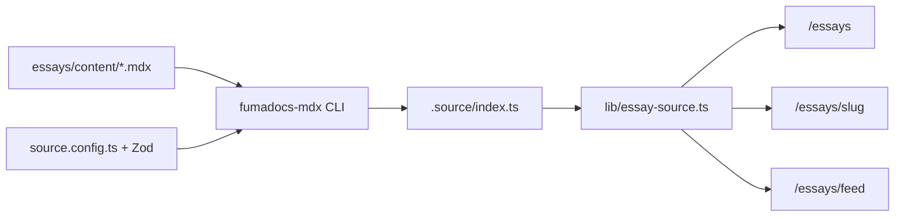

# feat-0029: Tech — MDX Essays (`/essays`, `/essays/who-is-imili`)

## Context

See [PRODUCT.md](./PRODUCT.md). Port the essays stack from **damola-oladipo** (`/Users/pro/Documents/madebydamola/damola-oladipo`) into **imil-institute**, shipping MDX content, index route, and launch essay `who-is-imili`.

---

## Objective

1. Install and configure **fumadocs-mdx** + **fumadocs-core** + MDX toolchain.
2. Add `source.config.ts` with Zod frontmatter schema.
3. Create `essays/content/who-is-imili.mdx` (production essay).
4. Implement `app/essays/page.tsx` and `app/essays/[slug]/page.tsx`.
5. Centralize essay data access in `lib/essay-source.ts`.
6. Wire navigation to `/essays`.
7. Ship RSS at `/essays/feed`.

---

## Tech stack

| Layer | Choice |
| ----- | ------ |
| Framework | Next.js 16 App Router (repo root) |
| MDX | fumadocs-mdx 11.x, @mdx-js/react 3.x |
| Content loader | fumadocs-core `loader()` + `createMDXSource()` |
| Schema | Zod via `frontmatterSchema.extend()` |
| Markdown | remark-gfm (tables, task lists, strikethrough) |
| Typography | @tailwindcss/typography |
| Images | next/image |
| Styling | Tailwind v4 + existing IMILI tokens |
| Generated output | `.source/` — **commit** `index.ts` to git (match reference; run `fumadocs-mdx` on install/build) |
| Package manager | **npm** |

---

## Commands

```bash
# Install dependencies
npm install fumadocs-mdx fumadocs-core fumadocs-ui @mdx-js/react @mdx-js/loader @types/mdx remark-gfm @tailwindcss/typography

# Update package.json scripts (required)
# "dev": "fumadocs-mdx && next dev"
# "build": "fumadocs-mdx && next build"
# "postinstall": "fumadocs-mdx"

npm run dev
npm run build
npm run lint
npx fumadocs-mdx   # manual regenerate .source
```

Manual QA:

1. Open `http://localhost:3000/essays` — list shows “Who Is IMILI?”
2. Open `http://localhost:3000/essays/who-is-imili` — full article renders
3. View source — confirm meta tags and canonical
4. Open `http://localhost:3000/essays/feed` — RSS validates
5. Run build — no MDX/schema errors

---

## Project structure

```text
./
├── source.config.ts
├── mdx-components.tsx
├── next.config.ts
├── .source/                            # GENERATED — commit index.ts
├── essays/content/who-is-imili.mdx
├── types/essay.ts
├── lib/essay-source.ts
├── app/
│   ├── layout.tsx                      # UPDATE
│   ├── sitemap.ts                      # NEW or UPDATE
│   └── essays/
│       ├── page.tsx
│       ├── feed/route.ts
│       └── [slug]/
│           ├── page.tsx
│           └── metadata.ts
├── components/
│   ├── essay-card.tsx
│   ├── essay-share-buttons.tsx
│   ├── hash-scroll-handler.tsx
│   ├── read-more-section.tsx
│   ├── tag-filter.tsx
│   ├── essay-mobile-toc.tsx
│   ├── table-of-contents.tsx
│   ├── mdx/youtube.tsx
│   └── sections/essays.tsx
├── public/essays/who-is-imili.png
├── _data/site-config.tsx               # UPDATE
├── _data/imili/header-nav.ts           # UPDATE
└── _specs/feat-0029/
```

---

## 1. Dependencies and scripts

### package.json scripts

```json
{
  "scripts": {
    "dev": "fumadocs-mdx && next dev",
    "build": "fumadocs-mdx && next build",
    "postinstall": "fumadocs-mdx"
  }
}
```

### next.config.ts

```ts
import type { NextConfig } from "next";
import { createMDX } from "fumadocs-mdx/next";

const withMDX = createMDX();

const nextConfig: NextConfig = {
  /* existing config */
};

export default withMDX(nextConfig);
```

### tsconfig.json

Ensure generated source resolves:

```json
{
  "compilerOptions": {
    "paths": { "@/*": ["./*"] }
  },
  "include": [
    "next-env.d.ts",
    "**/*.ts",
    "**/*.tsx",
    ".source/**/*.ts"
  ]
}
```

Do **not** gitignore `.source/` — CI and fresh clones depend on committed `index.ts` OR `postinstall` regeneration (both: commit + postinstall is safest).

### fumadocs-ui styles (if Callouts look unstyled)

If default MDX components render without styles, add to `app/globals.css`:

```css
@import "fumadocs-ui/css/neutral.css";
```

Only add if visual QA shows broken Callout/card styling.

---

## 2. source.config.ts

```ts
import {
  defineConfig,
  defineDocs,
  frontmatterSchema,
} from "fumadocs-mdx/config";
import { z } from "zod";
import remarkGfm from "remark-gfm";

export default defineConfig({
  lastModifiedTime: "git",
  mdxOptions: {
    providerImportSource: "@/mdx-components",
    remarkPlugins: [remarkGfm],
  },
});

export const { docs, meta } = defineDocs({
  dir: "essays/content",
  docs: {
    schema: frontmatterSchema.extend({
      date: z.string(),
      tags: z.array(z.string()).optional(),
      featured: z.boolean().optional().default(false),
      readTime: z.string().optional(),
      author: z.string().optional(),
      thumbnail: z.string().optional(),
      draft: z.boolean().optional().default(false),
    }),
  },
});
```

Filter published essays in `lib/essay-source.ts`:

```ts
import type { EssayPage } from "@/types/essay";

const isDev = process.env.NODE_ENV === "development";

export function getPublishedEssayPages(): EssayPage[] {
  return getAllEssayPages().filter((page) => {
    const draft = (page.data as { draft?: boolean }).draft;
    if (!draft) return true;
    return isDev; // optional: allow draft preview in dev only
  }) as EssayPage[];
}

export function getPublishedEssayPage(slug: string) {
  const page = getEssayPage(slug);
  if (!page) return null;
  const draft = (page.data as { draft?: boolean }).draft;
  if (draft && process.env.NODE_ENV === "production") return null;
  return page;
}
```

---

## 3. types/essay.ts

```ts
import type { ComponentType } from "react";

export interface EssayPageData {
  title: string;
  description?: string;
  body: ComponentType;
  date: string;
  tags?: string[];
  featured?: boolean;
  readTime?: string;
  author?: string;
  thumbnail?: string;
  draft?: boolean;
}

export interface EssayPage {
  url: string;
  data: EssayPageData;
}
```

---

## 4. lib/essay-source.ts (DRY — reference duplicates this 6×)

```ts
import { docs, meta } from "@/.source";
import { loader } from "fumadocs-core/source";
import { createMDXSource } from "fumadocs-mdx";

const mdxSource = createMDXSource(docs, meta);

export const essaySource = loader({
  baseUrl: "/essays",
  source: {
    get files() {
      return (mdxSource as unknown as { files(): unknown[] }).files();
    },
  } as Parameters<typeof loader>[0]["source"],
});

export function getAllEssayPages() {
  return essaySource.getPages();
}

export function getEssayPage(slug: string) {
  return essaySource.getPage([slug]);
}
```

All routes and components import from `@/lib/essay-source` — never re-instantiate the loader.

---

## 5. mdx-components.tsx

Port from reference `damola-oladipo/mdx-components.tsx` with these adjustments:

| Reference | IMILI |
| --------- | ----- |
| `getAuthor` from `@/_data/authors` | Remove or map to `_data/imili/authors.ts` with single `imili` key |
| Damola-specific promo components | Omit `PromoContent` unless product wants CTA sidebar |
| `defaultMdxComponents` from fumadocs-ui | Keep — provides Callout, Cards, etc. |

Minimum exports for v1:

- `h1`–`h4` with `CopyHeader` (optional — can simplify to plain headings in v1)
- `pre` / `code` styled code blocks
- `img` → `next/image` wrapper (reference `MdxImage`)
- `Accordion*` from Radix (already in IMILI deps)

```ts
import defaultMdxComponents from "fumadocs-ui/mdx";
import type { MDXComponents } from "mdx/types";

export function getMDXComponents(components?: MDXComponents): MDXComponents {
  return {
    ...defaultMdxComponents,
    ...components,
  };
}

export const useMDXComponents = getMDXComponents;
```

Expand incrementally after launch essay renders cleanly.

### YouTube MDX component

```tsx
// components/mdx/youtube.tsx
type YouTubeProps = { youtubeId: string; title?: string };

export function YouTube({ youtubeId, title = "YouTube video" }: YouTubeProps) {
  return (
    <div className="my-8 aspect-video w-full overflow-hidden rounded-lg">
      <iframe
        src={`https://www.youtube.com/embed/${youtubeId}`}
        title={title}
        allow="accelerometer; autoplay; clipboard-write; encrypted-media; gyroscope; picture-in-picture"
        allowFullScreen
        className="h-full w-full border-0"
      />
    </div>
  );
}
```

Register in `getMDXComponents`: `YouTube`.

Usage in `who-is-imili.mdx`:

```mdx
<YouTube youtubeId="oH2s7rjl8Os" title="IMILI Documentary" />
```

### Mobile TOC (no Drawer dependency)

Reference uses `vaul` Drawer — IMILI does not. Create `components/essay-mobile-toc.tsx`:

- Fixed button bottom-right (`lg:hidden`), `aria-label="Table of contents"`
- Radix `@/components/ui/accordion` panel slides up or expands inline
- Reuses `<TableOfContents refreshDelay={300} />` inside panel

### Tag filter mobile

Port `tag-filter.tsx` but replace reference `Drawer` with:

- **Desktop (`md+`):** pill buttons (same as reference)
- **Mobile:** single Accordion trigger “Filter by topic” listing tags

---

## 6. app/essays/page.tsx

```tsx
import type { Metadata } from "next";
import { siteConfig } from "@/_data/site-config";
import Essays from "@/components/sections/essays";

export const metadata: Metadata = {
  title: `Essays — ${siteConfig.title}`,
  description:
    "Long-form writing from the International Media and Information Literacy Institute.",
  openGraph: {
    url: `${siteConfig.url}/essays`,
    title: `Essays — ${siteConfig.title}`,
    type: "website",
  },
};

export default function EssaysPage({
  searchParams,
}: {
  searchParams: Promise<{ tag?: string }>;
}) {
  return <Essays searchParams={searchParams} />;
}
```

### components/sections/essays.tsx

Port logic from reference `components/sections/essays.tsx`:

- `getAllEssayPages()` from `@/lib/essay-source`
- Sort by `date` descending
- Map to `EssayCard`
- IMILI intro copy:

```tsx
<p className="text-muted-foreground text-lg leading-relaxed">
  Research, explainers, and institute perspectives on media and information
  literacy — written for educators, policymakers, and partners worldwide.
</p>
```

---

## 7. app/essays/[slug]/page.tsx

Port from reference `app/essays/[slug]/page.tsx`:

```tsx
import { notFound } from "next/navigation";
import Link from "next/link";
import Image from "next/image";
import { getEssayPage } from "@/lib/essay-source";
import { TableOfContents } from "@/components/table-of-contents";
import type { EssayPageData } from "@/types/essay";

export { generateMetadata } from "./metadata";

export default async function EssayPost({
  params,
}: {
  params: Promise<{ slug: string }>;
}) {
  const { slug } = await params;
  const page = getPublishedEssayPage(slug);
  if (!page) notFound();

  const data = page.data as EssayPageData;
  const MDX = data.body;

  return (
    <article className="min-h-screen bg-background">
      <header className="max-w-5xl mx-auto px-6 pt-28 md:pt-32 pb-10">
        <nav className="text-sm text-muted-foreground mb-6">
          <Link href="/">Home</Link>
          <span> / </span>
          <Link href="/essays">Essays</Link>
        </nav>
        <h1 className="text-3xl md:text-5xl font-semibold tracking-tight">
          {data.title}
        </h1>
        {/* date, readTime, description, tags, thumbnail — see reference */}
      </header>
      <div className="max-w-5xl mx-auto px-6 py-10 flex gap-12">
        <div className="prose prose-neutral max-w-none flex-1 prose-headings:scroll-mt-28 prose-a:text-primary">
          <MDX />
        </div>
        <aside className="hidden lg:block w-64 sticky top-28">
          <TableOfContents />
        </aside>
      </div>
      <EssayMobileToc />
      <HashScrollHandler />
    </article>
  );
}
```

**Static generation (required):**

```tsx
export function generateStaticParams() {
  return getPublishedEssayPages().map((page) => ({
    slug: page.url.replace("/essays/", ""),
  }));
}
```

---

## 8. app/essays/[slug]/metadata.ts

Port from reference. Key fields:

- `title`, `description` from frontmatter
- `openGraph.type: "article"`
- `openGraph.publishedTime: data.date`
- `alternates.canonical: ${siteConfig.url}/essays/${slug}`
- OG image: `data.thumbnail` (absolute URL) or site default

---

## 9. app/essays/feed/route.ts

Port verbatim from reference; swap `siteConfig` import to IMILI `_data/site-config.ts`.

```ts
export const dynamic = "force-dynamic";
export const revalidate = 3600;
```

---

## 10. Launch content — who-is-imili.mdx

```mdx
---
title: "Who Is IMILI?"
description: "The International Media and Information Literacy Institute — the world's first international observatory for MIL development, launched under the auspices of UNESCO."
date: "2026-06-26"
tags: ["About IMILI", "Media Literacy", "UNESCO"]
featured: true
readTime: "6 min read"
thumbnail: "/essays/who-is-imili.png"
---

## What IMILI is

The International Media and Information Literacy Institute (IMILI) is the first international observatory dedicated to Media and Information Literacy (MIL) development. IMILI serves as a catalyst for sustained research that offers empirical evidence on the social impact of MIL globally.

## Why media and information literacy matter

In a world of rapid information flows and widespread misinformation, media and information literacy equips citizens to access, evaluate, and create information responsibly. MIL supports digital citizenship, informed public debate, and progress toward the Sustainable Development Goals.

## What we do

IMILI advances MIL through research and analysis, a global clearinghouse of best practices, convening and networking among partners, and alignment with the global development agenda. Each pillar strengthens how countries monitor progress and shape effective MIL policy.

## Who we partner with

IMILI works with governments, educators, media organizations, civil society, and international partners — including UNESCO — to build resilient, informed societies.

## Watch the IMILI documentary

<YouTube youtubeId="oH2s7rjl8Os" title="IMILI Documentary" />

## Learn more

- [About IMILI](/about)
- [What we do](/what-we-do)
- [Latest news](/news)
- Contact us at [info@imilinstitute.org](mailto:info@imilinstitute.org)
```

**Engineering ships this starter copy.** Content team may refine prose before production deploy; do not ship HTML comment placeholders.

---

## 11. Navigation and site config

See [§18 Site config & metadata contract](#18-site-config--metadata-contract).

---

## 12. components/essay-card.tsx

Port from reference; adjust hover/focus to IMILI green accent if design system defines one.

Props:

```ts
interface EssayCardProps {
  url: string;
  title: string;
  description: string;
  date: string;
  thumbnail?: string;
  readTime?: string;
}
```

---

## 13. Tailwind typography

```bash
npm add @tailwindcss/typography
```

In `app/globals.css` or Tailwind config:

```css
@plugin "@tailwindcss/typography";
```

Tune prose link color to IMILI brand green.

---

## 14. Data flow diagram



---

## 15. File change summary

| File | Action |
| ---- | ------ |
| `package.json` | UPDATE — deps + scripts |
| `next.config.ts` | UPDATE — `createMDX()` |
| `source.config.ts` | CREATE |
| `mdx-components.tsx` | CREATE |
| `types/essay.ts` | CREATE |
| `lib/essay-source.ts` | CREATE — publish filter helpers |
| `essays/content/who-is-imili.mdx` | CREATE |
| `app/layout.tsx` | UPDATE — metadataBase, title template, RSS link |
| `app/sitemap.ts` | CREATE or UPDATE |
| `app/essays/page.tsx` | CREATE |
| `app/essays/[slug]/page.tsx` | CREATE |
| `app/essays/[slug]/metadata.ts` | CREATE |
| `app/essays/feed/route.ts` | CREATE |
| `components/essay-card.tsx` | CREATE |
| `components/essay-share-buttons.tsx` | CREATE |
| `components/hash-scroll-handler.tsx` | CREATE |
| `components/read-more-section.tsx` | CREATE |
| `components/tag-filter.tsx` | CREATE |
| `components/essay-mobile-toc.tsx` | CREATE |
| `components/table-of-contents.tsx` | CREATE |
| `components/mdx/youtube.tsx` | CREATE |
| `components/sections/essays.tsx` | CREATE |
| `_data/site-config.tsx` | UPDATE |
| `_data/imili/header-nav.ts` | UPDATE |
| `components/custom/header.tsx` | UPDATE — active nav state for `/essays` |
| `public/essays/who-is-imili.png` | CREATE (asset) |
| `.source/index.ts` | GENERATED — commit |

---

## 16. SEO appendix

### metadataBase + title template (`app/layout.tsx`)

```tsx
import { siteConfig, absoluteOgImageUrl } from "@/_data/site-config";

export const metadata: Metadata = {
  metadataBase: new URL(siteConfig.url),
  title: {
    default: siteConfig.title,
    template: `%s — ${siteConfig.name}`,
  },
  description: siteConfig.description,
  alternates: {
    types: {
      "application/rss+xml": `${siteConfig.url}/essays/feed`,
    },
  },
};
```

### JSON-LD on essay page

```tsx
function EssayJsonLd({ title, description, date, url }: {
  title: string; description?: string; date: string; url: string;
}) {
  const json = {
    "@context": "https://schema.org",
    "@type": "Article",
    headline: title,
    description,
    datePublished: date,
    url,
    publisher: {
      "@type": "Organization",
      name: siteConfig.fullName,
      url: siteConfig.url,
    },
  };
  return (
    <script
      type="application/ld+json"
      dangerouslySetInnerHTML={{ __html: JSON.stringify(json) }}
    />
  );
}
```

### Sitemap (`app/sitemap.ts`)

```ts
import type { MetadataRoute } from "next";
import { siteConfig } from "@/_data/site-config";
import { getPublishedEssayPages } from "@/lib/essay-source";

export default function sitemap(): MetadataRoute.Sitemap {
  const base = siteConfig.url.replace(/\/$/, "");
  const essays = getPublishedEssayPages().map((page) => ({
    url: `${base}${page.url}`,
    lastModified: new Date(page.data.date),
    changeFrequency: "monthly" as const,
    priority: 0.7,
  }));

  return [
    { url: base, changeFrequency: "weekly", priority: 1 },
    { url: `${base}/essays`, changeFrequency: "weekly", priority: 0.8 },
    ...essays,
  ];
}
```

### Essay metadata Twitter cards

Match index pattern — `summary_large_image`, `images` from thumbnail or `absoluteOgImageUrl()`.

---

## 17. Site config & metadata contract

### `_data/site-config.tsx` additions

```tsx
function getCanonicalSiteUrl(): string {
  const explicit = process.env.NEXT_PUBLIC_SITE_URL?.trim();
  if (explicit) {
    const withProtocol = /^https?:\/\//i.test(explicit)
      ? explicit
      : `https://${explicit}`;
    try {
      return new URL(withProtocol).origin;
    } catch {
      /* fall through */
    }
  }
  return "https://www.imili.org";
}

export const siteConfig = {
  // ...existing fields
  url: getCanonicalSiteUrl(),
  baseLinks: {
    home: "/",
    essays: "/essays",
    about: "/about",
    news: "/news",
    contact: "/contact",
  },
};

export function absoluteOgImageUrl(path?: string): string {
  const imagePath = path ?? siteConfig.ogImage;
  const base = siteConfig.url.replace(/\/$/, "");
  if (imagePath.startsWith("http")) return imagePath;
  return `${base}${imagePath.startsWith("/") ? imagePath : `/${imagePath}`}`;
}
```

### Header nav active state

In `components/custom/header.tsx` (and mobile drawer), mark Essays active when:

```ts
pathname === "/essays" || pathname.startsWith("/essays/");
```

---

## 18. MDX authoring guide (for content team)

| Rule | Detail |
| ---- | ------ |
| Filename | `kebab-case.mdx` → URL `/essays/kebab-case` |
| Title | Set in frontmatter only — do not repeat as `#` in body |
| Sections | Start body at `##` |
| Images | `` — file must exist in `public/` |
| Links | Prefer internal `/about` paths; external links open normally |
| Draft | `draft: true` until ready to publish |
| Date | ISO `YYYY-MM-DD`; use publish date, not draft date |
| readTime | Manual estimate, e.g. `"6 min read"` |
| Embeds | `<YouTube youtubeId="..." title="..." />` only custom embed in v1 |
| No JSX pages | Never paste React components / `export default` in MDX |

---

## 19. Testing strategy

| Check | Method |
| ----- | ------ |
| Build | `npm run build` exits 0 |
| Routes | Manual smoke on `/essays`, `/essays/who-is-imili`, 404 slug |
| RSS | `curl -s localhost:3000/essays/feed \| head` |
| Sitemap | `curl -s localhost:3000/sitemap.xml` contains `/essays/who-is-imili` |
| Schema | Remove `date` from test MDX — build must fail |
| Draft | `draft: true` essay absent from index in production build |
| a11y | Lighthouse on essay page — single H1, alt text, button labels |
| CI | Vercel build runs `postinstall` → `fumadocs-mdx` before `next build` |

---

## 20. Known reference issues (do not reproduce)

1. **Duplicated loader** — reference instantiates `essaySource` in 6 files; IMILI uses `lib/essay-source.ts`.
2. **Pasted page code in MDX** — several reference `.mdx` files contain `export default async function EssayPage` fragments; keep MDX content-only.
3. **Dead `lib/essaymarkdown.ts`** — gray-matter filesystem reader unused by fumadocs path; do not port.
4. **Author default `dillion`** — reference falls back to wrong author key; IMILI displays **IMILI** / `siteConfig.fullName` when `author` omitted.
5. **`images.unoptimized: true`** — IMILI `next.config.ts` already sets this; acceptable for v1; revisit perf in feat-0030+ if needed.
6. **Do not add `vaul` Drawer** — use existing Radix Accordion for mobile TOC and tag filter.

---

## 21. Future feats (out of scope pointers)

| ID | Scope |
| -- | ----- |
| feat-0030 | Per-essay `opengraph-image.tsx` dynamic OG |
| feat-0031 | Homepage `LatestEssays` section using `featured` frontmatter |
